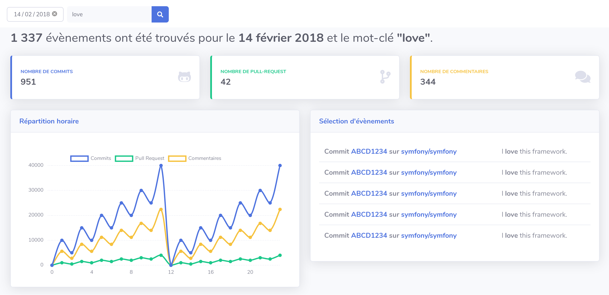

# Challenge GH Archive Keyword

>  tl;dr :  l'objectif de ce challenge est de développer avec [GH Archive](https://www.gharchive.org/) 
>  une API REST en PHP sur la présence d'un mot-clé parmi les messages de commits d'un jour donné, 
>  par exemple une courbe du nombre de commits dans la journée du 14/02/2018 qui ont le mot-clé "love".

## Évaluation :trophy: 

Le code sera évalué sur les critères suivants *(laissés à votre libre interprétation)* :

* Respect des consignes
* Rigueur
* Qualité du code
* Qualité des features délivrées
* Documentation
* Tests (PHPUnit est imposé pour les tests untaires)

## Consignes :woman_teacher:

* Vous livrerez votre projet sur un dépôt GitHub privé
* Vous réaliserez l'ensemble du scope fonctionnel spécifié ci-dessous
* Vous rendrez le livrable **dans un délai de 7 jours**
* Vous utiliserez **Symfony 4.4** et **PHP 7.4**
* Vous utiliserez un SGBD relationnel : **PostgreSQL, MySQL ou MariaDB**
* Vous devrez **exploiter les fichiers `.json.gz`** disponible sur [GH Archive](https://www.gharchive.org/) ; en d'autres termes vous n'utiliserez **pas** le dataset public Google BigQuery pour l'import des données
* Vous n'utiliserez **pas** de framework d'API comme FOSRestBundle ou API Platform

## Objectifs :rocket:

[GH Archive](https://www.gharchive.org/) est un site qui permet de retrouver l'historique 
des évènements publiques qui ont été réalisés sur GitHub pendant une période donnée.

L'objectif premier de ce challenge est de récupérer certains [événements](https://docs.github.com/en/developers/webhooks-and-events/github-event-types)
de [GH Archive](https://www.gharchive.org/) afin de les stocker dans une base de données. 
Cette partie sera réalisée par une commande CLI.

Il s'agira ensuite de créer une API REST avec 1 ou plusieurs routes permettant d'aller interroger les informations 
de cette base de données, en renseignant une **date** et **un mot-clé**.

Cette API doit notamment permettre de répondre aux besoins de l'interface de dashboard suivante : 



Le test d'acceptation associé au dashboard :

```Gherkin
En tant qu'utiisateur du dashboard GH Archive Keyword
Lorque je renseigne une date et un mot clé
Alors pour les critères de recherche saisis le nombre total d'évènements est affiché
Et le nombre total par type d'évènements est affiché 
Et le nombre total par type d'évènements par heure est affiché
Et les 5 derniers commits sont visibles
```

# How to use development environment :computer:

You only need `make`, `docker` and `docker-compose` installed to start the development environment.

## Start the development environment

The following command will start the development environment.
You can access to the application at http://127.0.0.1:8000/ :

```bash
make start
```

## Access to a shell in the PHP container

```bash
make shell
```

## Tests tools

You can run PHPUnit with the following command:
```bash
# Run the unit test suite
make unit-test

# Run the functionnal test suite
make func-test
```

## Stop the development environment

You can stop the development environment running this command:
```bash
make stop
```

## Clean the development environment

You can clean the development environment (docker images, vendor, ...) running this command:
```bash
make clean
```

## Makefile targets

You can get available targets by running:
```bash
make
```

```bash
build                          Build the docker stack
pull                           Pulling docker images
shell                          Enter in the PHP container
start                          Start the docker stack
stop                           Stop the docker stack
clean                          Clean the docker stack
vendor                         Install composer dependencies
unit-test                      Run PhpUnit unit testsuite
func-test                      Run PhpUnit functionnal testsuite
```
**Nous vous encourageons à vous faire plaisir pendant ce challenge !**

# Bon courage ! :muscle: